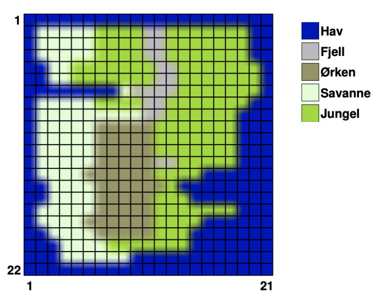

BioSim project
=======================

Modelling the ecosystem of Rossumøya
------------------------------------
In this project, we have created a simulation of the ecosystem on the island
Rossumøya. This project was tasked by the Enviornmental Protecion Agency of
Pylandia (EPAP).

The simulation simulates the behaviour of herbivores and carnivores on the
island over a number of years. We have looked at behaviour such as feeding,
procreation and migration in the different landscape types that can be found on
Rossumøya.

**Geography of Rossumøya**

The goal of this simulation has been to determine whether both species,
herbivores and carnivores, are able to survive in the long term on the island.

Examples and code documentation can be found in the next content pages.

Acknowledgements
----------------
We are grateful to *Yngve Mardal Moe*, director of EPAP, and special advisors
*Daniel Prince*, *Ngoc Bao* and *Ahmed Albuni* for their advice and helpful guidance
with this project.

